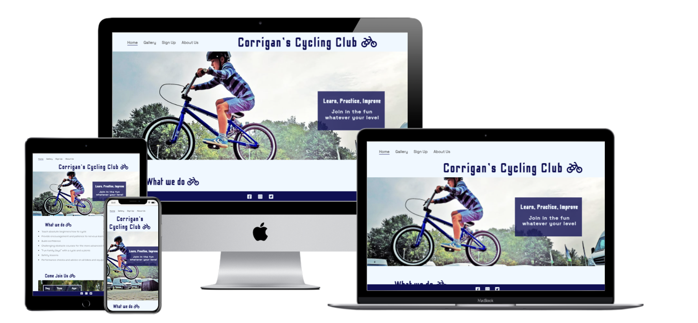
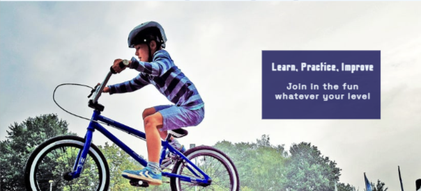
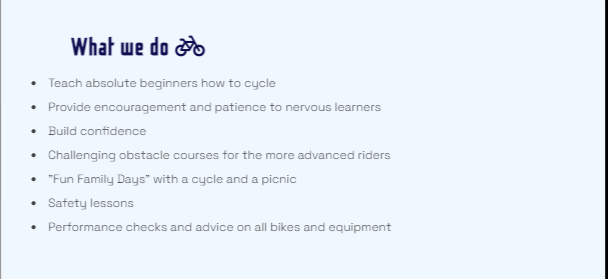
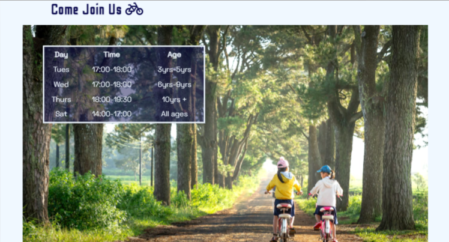
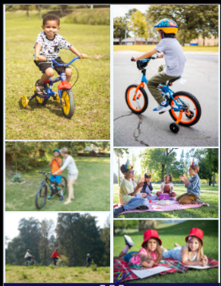
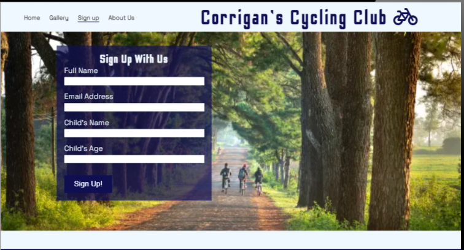
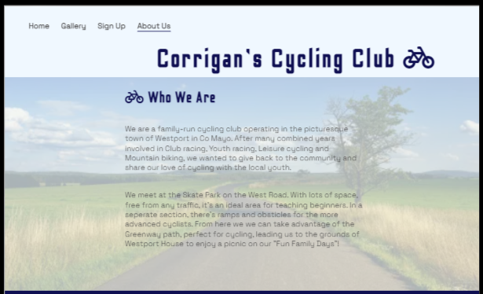
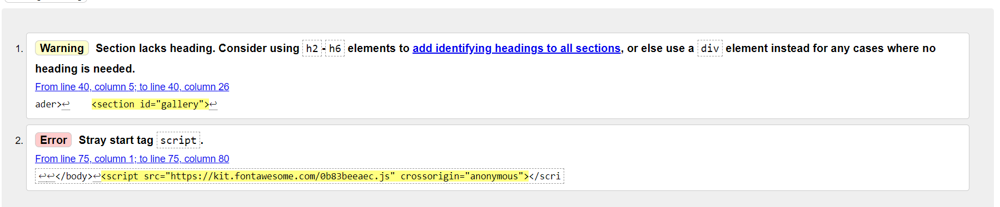
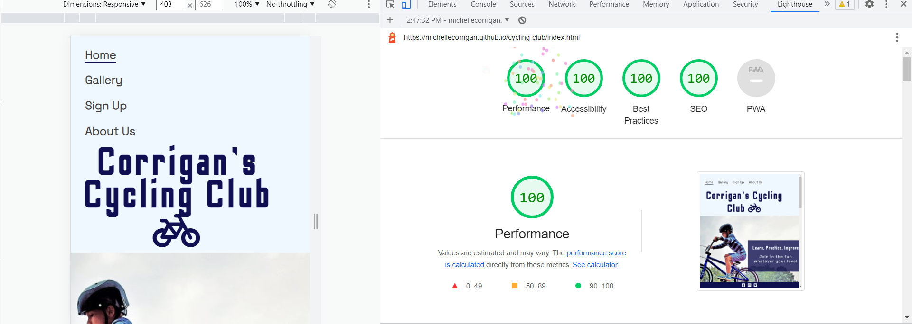

# Corrigan's Cycling Club website

The Corrigan's Cycling Club website is for parents and children looking for a fun cycling club where kids can learn and improve their cycling skills.
Users of this website will be able to find all the information they need to know about the club: Services offered, meeting times, a sign-up form and a quick introduction about the club. It will include a gallery page with suppporting images of current members practicing their skills and enjoying the activities.

 

## Features 

### Existing Features

- __Navigation Bar__

  - Featured on all four pages, the full responsive navigation bar includes links to the Logo, Home page, Gallery, Sign Up page and About Us page and is identical in each page to allow for easy navigation.
  - This section will allow the user to easily navigate from page to page across all devices without having to revert back to the previous page via the ‘back’ button. 

- __The landing page image__

  - The landing includes a photograph with text overlay of a tagline for the club.
  - This section introduces the user to Corrigan's Cycling Club with an eye catching animation to grab their attention.
  - The user can quickly see it's a child-friendly club.  

- __What We Do Section__

  - The 'What We Do' section will allow the user to see the services available from the club.
  - This user will see the value of signing themselves or their child up for the meetups. This should encourage the user to feel confident about joining.

- __Come Join Us section__

  - This section will allow the user to see exactly when the meetups will happen, for which age groups and for how long. 
  - This section can be updated when these times change during different times of the year to keep the user up to date. 

- __The Footer__ 

  - The footer section includes links to the relevant social media sites for Corrigan's Cycling Club. The links will open to a new tab to allow easy navigation for the user. 
  - The footer is valuable to the user as it encourages them to keep connected with the club and other members via social media.

- __Gallery__

  - The gallery will provide the user with supporting images to see what the weekly meet ups and 'Fun Family Days' with a cycle and a picnic will look like. 
  - This section is valuable to the user as they will be able to easily see all the fun, safety and learning aspects of the club. 

- __The Sign Up Page__

  - This page will allow the user to get their child signed up to Corrigan's Cycling Club. The user will be asked to submit their full name, email address, child's name and child's age-group. 
  - Users will be taken to a Thank-you page after signing up.

- __The About Us Page__

  - This page will give the user a brief introduction into the club. 
  - It will include information on the park where the club meets and the benefits of that park.

### Features Left to Implement

- The About Us page could include a small profile piece of each instructor within the club, with an accompanying photo. The user and their child would be reassured about who they were going to meet. 

## Testing 

### Validator Testing 

- HTML
  - An error and a warning were returned when passing through the official [W3C validator](https://validator.w3.org/nu/?doc=https%3A%2F%2Fcode-institute-org.github.io%2Flove-running-2.0%2Findex.html)
  - The font awesome script source was moved inside the body on all html files.
  - A div element with id=gallery was added to the gallery page.
  - When the code was passed through the W3C validator again no errors were found.

- CSS
  - No errors were found when passing through the official [(Jigsaw) validator](https://jigsaw.w3.org/css-validator/validator?uri=https%3A%2F%2Fvalidator.w3.org%2Fnu%2F%3Fdoc%3Dhttps%253A%252F%252Fcode-institute-org.github.io%252Flove-running-2.0%252Findex.html&profile=css3svg&usermedium=all&warning=1&vextwarning=&lang=en#css)

### Functionality testing

  - I used Chrome developer tools throughout the project for testing and solving problems with responsiveness and style issues.

### Compatibility testing

  - Site was tested across multiple virtual mobile devices. I checked all supported devices in Chrome developer tools.
  - Site was tested on several browsers including Chrome, Microsoft Edge, Safari and Firefox.
  - I tested on hardware devices such as: HP Pavilion R3 with Windows OS's, Samsung Galaxy A32 smartphone with Android 11, IPhone Xs with iOS 15.4.1

### Accessibility Testing

  - I tested the colors and fonts chosen on lighthouse in chrome devtools to make sure they were easy to read.

### Bugs
  - When I renamed the contact.html file to signup.html the link on the home page wasn't working. I deleted the link on the home page and copy and pasted the link from the about.html page and this fixed the problem.
  - Unable to link custom 404 error page to site. I realised the file was wrongly named, I changed it from 404error.html to 404.html and this fixed the problem.

## Deployment 

- The site was deployed to GitHub pages. The steps to deploy are as follows: 
  1. Open the repository on GitHub
  2. Go to "Settings" (the tab on the right)
  3. On the left hand side select pages, select the main branch as the source.  Then it shows you a green confirmation. 

The live link can be found here - https://michellecorrigan.github.io/cycling-club/

- To run localy:

  1. Log in to GitHub and click on repository to download [cycling-club](github.com/MichelleCorrigan/cycling-club)
  2. Select Code and click Download the ZIP file.
  3. After download you can extract the file and use it in your local environment
- Alternatively you can Clone or Fork this repository [cycling-club](github.com/MichelleCorrigan/cycling-club) into your github account.

## Technologies used
### HTML5
As a structure language.
### CSS
As a style language.
### Font Awesome
As an icon library for a social links.
### Google fonts
As a font resource.
### GitHub
As a software hosting platform to keep project in a remote location.
### Git
As a version-control system tracking.
### Gitpod
As a development hosting platform.
### Cloudinary
As an image editor.

## Credits 

- To complete this project I used Code Institute student template: [gitpod full template](https://github.com/Code-Institute-Org/gitpod-full-template)

### Content 

- The fonts used were taken from Google Fonts [Google Fonts](https://fonts.google.com)

- The icons in the footer were taken from [Font Awesome](https://fontawesome.com/)

### Media

- All images used were taken from [Pexels](https://www.pexels.com)

### Code

- The code for Meta data, Hero image animation, Sign-up form and join-button was taken from Code Institute's Love Running walkthrough project.
- The code for days-times table, gallery layout and footer was taken from W3Schools.

### This project is for educational purposes and can not be used as a template for a business use. Main aim is to build responsive website with HTML and CSS only.